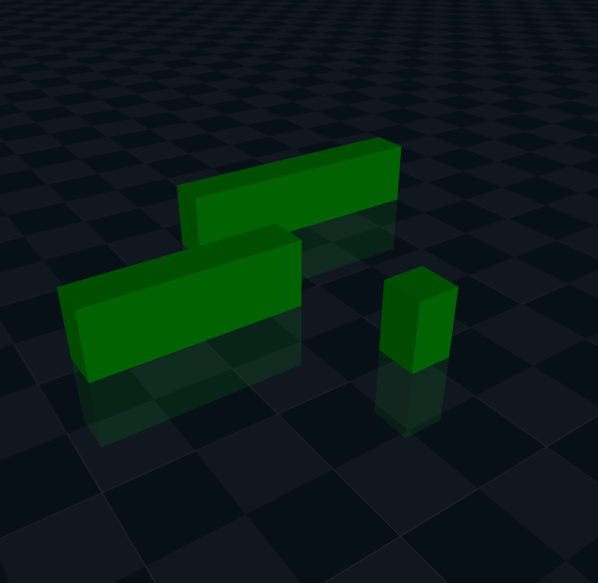
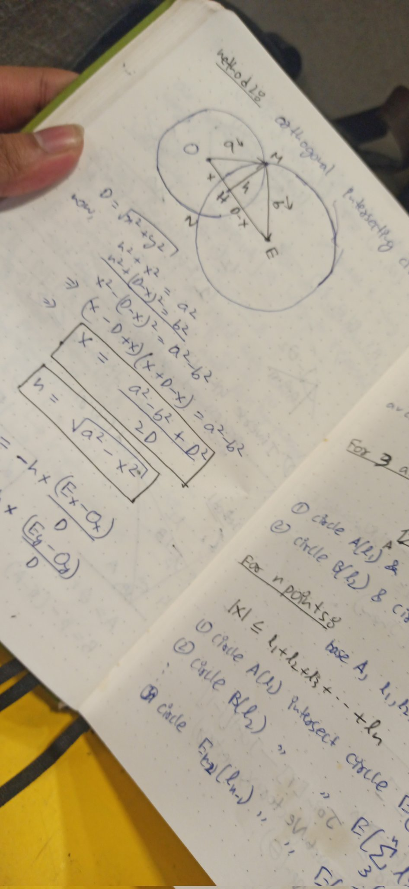
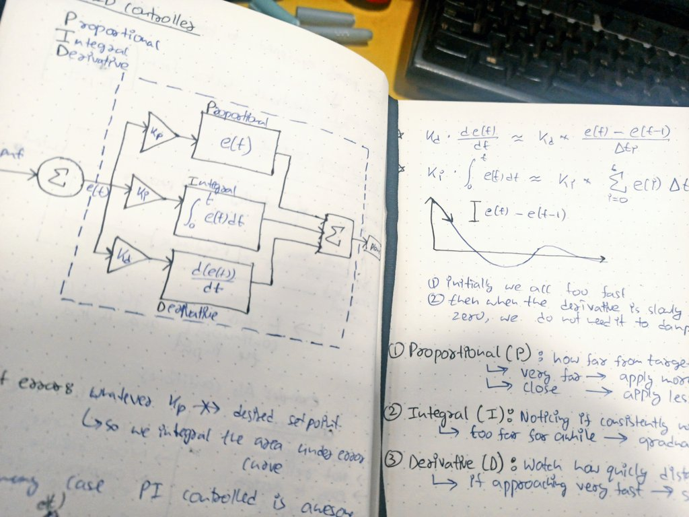
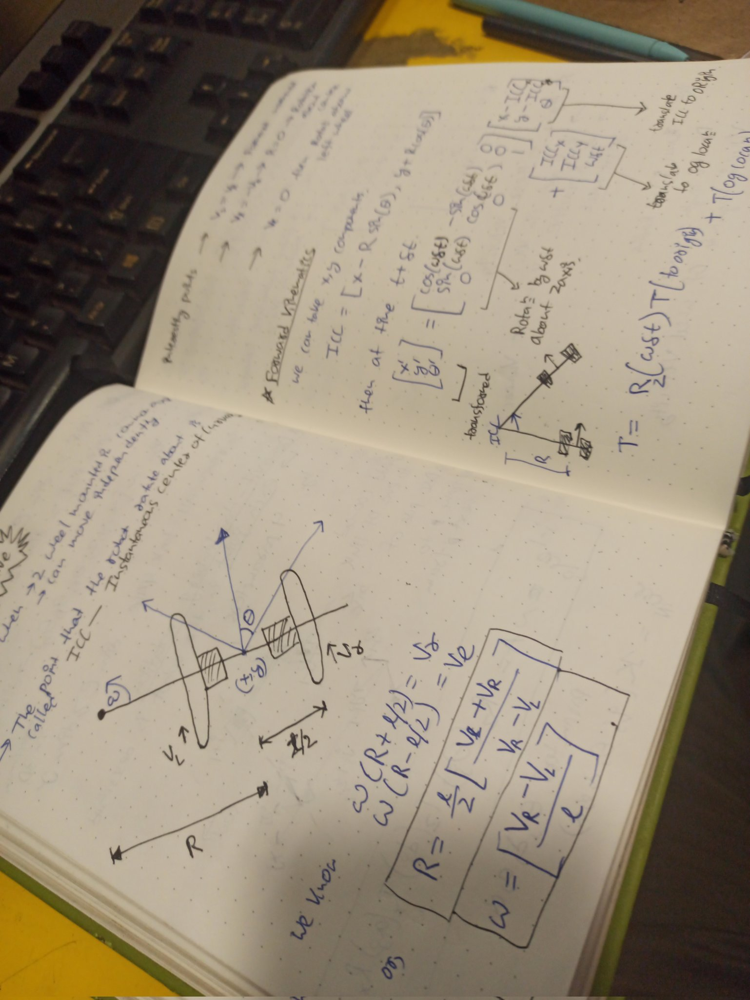
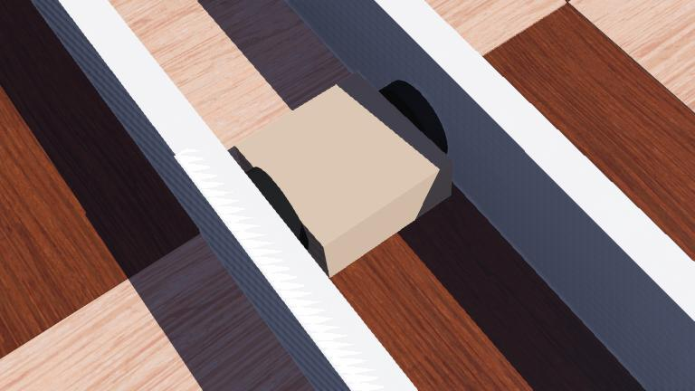
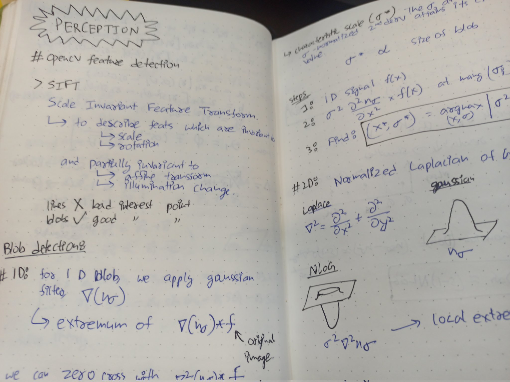

# 100 Days of Robotics

I am making this curriculum while I go. I keep in mind about people like me who did not come from robotics or engineering background, but with basic maths and enough of python basics, so that one can learn the fundamentals and get a grasp by hands-on practice.

There will be days which would look like can be done in one day but actually because of life or coding errors would take more than 1 day but that is fine! I am hoping to make this challange as something to teach and learn for the sake of love for it and not to impose artificial deadlines!

**You can find the codes here:** [GitHub](https://github.com/TumAro/100DoR)

I will be laying this in 6 phases, namely,
- Phase 1: Foundation & Simulation environment
- Phase 2: Perception & Mapping
- Phase 3: Motion Planning & Control
- Phase 4: Learning & Adaption
- Phase 5: Advance Integration & System Design
- Phase 6: Final Project

After I have update at least the Phase 1 fully, then I will release the github repo for everyone to use as reference. Meanwhile you can check on my timely updates in my [twitter](https://twitter.com/tumaro1001)

---

### Phase 1: Foundation & Simulation environment

**D1 - first robot**  
`>>` install all python and dependencies.  
`>>` install [PyBullet](https://pybullet.org/wordpress/index.php/forum-2/)  
`>>` define a simple robot with URDF  
`>>` give basic movement functionality  
`>>` simulate it.  
<video src="https://files.catbox.moe/i76psh.mp4" controls="controls" style="max-height: 400px;"></video>

**D2 - programming for robots**  
`>>` Know basic functional python  
`>>` know how URDF works, joints and links, etc.  
`>>` after going through documentations to check how to move the joints like `setJointMotorControl2` code the movements  
`>>` make the robot dance smoothly in a pattern  

**D3 - robot simulation environment**  
`>>` install MuJoCo  
`>>` tinker with mujoco models formatted in xml  
`>>` learnt how to work with mujoco xml; coordinates, movements, etc.  
`>>` setup complex obstacle environment in mujoco  
`>>` custom WASD movement with mujoco  

**D4 - physics in simulation**  
`>>` understand what physics engines are  
`>>` tweak around the basics of gravity and collision with BOX2D  
`>>` in MuJoCo, experimented with different gravity  
`>>` experimented collision between a sphere and a squishy cube

**D5.1 - learn the theory of representation**  
`>>` Learnt about system presentation  
`>>` learnt about system translation and rotation in simple states  
`>>` learnt to apply rotation in 3d space  
`>>` learnt about homogenous transformation to trivialize transformation in higher spaces.  
`>>` studied the euler angles and euler rotation theorem  

**D5.2 - theory for forward and inverse kinematics**  
`>>` used tkinter to visualise a 2D forward kinematics principle  
`>>` learnt all the necessary inverse kinematics and joint angles  
`>>` learnt how to solve for IK with both trigonometric and intersection of circle methods  
`>>` created a dashboard with tkinter to update the arm with given end point co-ordinate  
<video src="https://files.catbox.moe/m4xf4w.mp4" controls="controls" style="max-width: 300px;"></video>

**D6 - Intro to Robot Sensors and obstacle detection**  
`>>` learn pygame and pymunk to simulate  
`>>` study collision detection theory - Separated Axis Theorem  
`>>` simulate collision detection  
`>>` add bounce back path after each collision  
<video src="https://files.catbox.moe/5ulvhm.mp4" controls="controls" style="max-width: 600px;"></video>

**D7 - Open loop basic robot control**  
`>>` setup webots  
`>>` learn about open loop  
`>>` learn simple drive system mechanics for e-puck bot  
`>>` implemented a time based predetermined path to follow  

**D8 - Closed loop feedback control**  
`>>` closed loop control and feedback  
`>>` introduction to PID controllers  
`>>` understand and fine tune *kp, ki, kd*  
`>>` implement a feedforward control for a robot to move to a box but never collide  

<video src="https://files.catbox.moe/2ihzdb.mp4" controls="controls" style="max-width: 600px;"></video>

**D9 - Tuning PID controllers**  
`>>` learnt about PID tuning- heuristic, Ziegler-Nichols, Cohen-Coon.  
`>>` learnt how the nodes in webots work, while implementing a track path  
`>>` tested and analysed a lot of *kp* values for ZN methods to calculate TU and KU for line follower  
`>>` tested a lot on webot, external controls and analysing time v/s control curves  
`>>` finally heuristically achieved control for line following with only two sensor  
`>>` implemented Ziegler-Nichols tuning method perfectly.  
<video src="https://files.catbox.moe/zocd6c.mp4" controls="controls" style="max-width: 600px;"></video>
<video src="https://files.catbox.moe/hoax95.mp4" controls="controls" style="max-width: 600px;"></video>

**D10 - Forward Kinematics on UR3E**  
`>>` Review forward kinematics  
`>>` Revised homogeneous transformation for rotations and translations  
`>>` learnt about Denavit-Hartenberg notation  
`>>` implemented manual control for *UR3E* bot  
`>>` learnt about importance of choosing axis when performing homogeneous transforms  
`>>` real time FK calculator with tkinter  
<video src="https://files.catbox.moe/eevpo3.mp4" controls="controls" style="max-width: 600px;"></video>
<video src="https://files.catbox.moe/lnj6rw.mp4" controls="controls" style="max-width: 600px;"></video>

**D11 - Differential Drive Theory**  
`>>` learnt theory of differential drive kinematics  
`>>` created a differential drive bot in webots  
`>>` Implement velocity control  
`>>` put it in a path and predict the movement with the equation  
`>>` plot the equation, the path looked successfully predicted  

**D12 - Wall follow with Differential drive**  
`>>` created parallel wall  
`>>` added sensors to differential drive bot  
`>>` tuned PID for wall follow  
`>>` created complex wall turns  
`>>` tuned control for turns  

<video src="https://files.catbox.moe/rmn2sn.mp4" controls="controls" style="max-width: 600px;"></video>

**D13 - Add turnings for complex mazes/ Learn about mechanism**  
`>>` add proper wall detection  
`>>` fine tune PID turning for L, U and large corridor turns  
`>>` learn about theoretical mechanisms - kinematics pair, inversion, Loop Closure Equations, principles of 4-linkage mechanism  
<video src="https://files.catbox.moe/zaem5x.mp4" controls="controls" style="max-width: 600px;"></video>

**D14 & D15 - Implementing IRL**  
`>>` In Progress  

---

### Phase 2: Perception & Mapping  
  
**D16 - Color Detection and Tracking**  
`>>` setup openCV  
`>>` mask only red ball segment using BGR-2-HSV  
`>>` find the centroid  
`>>` fine tune PID controller to follow the centroid  
<video src="https://files.catbox.moe/spmcwv.mp4" controls="controls" style="max-width: 600px;"></video>

**D17 - Tracking and recovery of lost item**  
`>>` refactored color tracking  
`>>` rotation logic based on differential drive  
`>>` added an object loss recovery algorithm  
<video src="https://files.catbox.moe/hlxqxw.mp4" controls="controls" style="max-width: 600px;"></video>

**D18 - Feature detection with openCV**  
`>>` learnt gaussian filtering, NLoG, DoG  
`>>` learnt FAST, Harris Corner Detection  
`>>` implemented SIFT feature detection  
`>>` implemented ORB feature detection  
`>>` tested both with random objects in gazebo sim  

<video src="https://files.catbox.moe/47b651.mp4" controls="controls" style="max-width: 600px;"></video>
